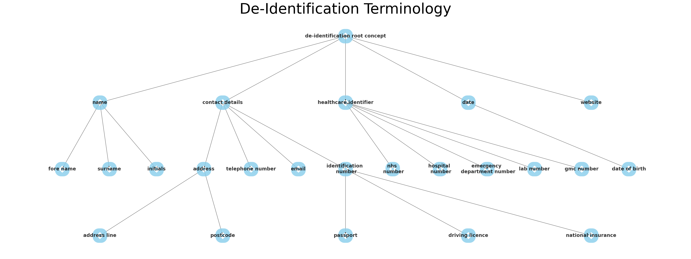

# Automated de-identification of free-text electronic patient records (EPR)

Medical records are full of confidential and highly sensitive patient information, which are required
to be removed if they are to be used for secondary purposes beyond direct patient care.

This project aims to remove and mask the personal data from within patient records whilst
retaining the top level meaning of the redacted information.

__For example:__
 "John suffers from Epilepsy. He was born on 01/01/1900"
 "\[Patient first name\] suffers from Epilepsy. He was born on \[Date of birth\]"

This repository is currently incomplete and is not for production use.

## Personal information redacted

A brief overview of the categories of personal information redacted.

|Value|Description|
|---|---|
|Names| First and last names and any abbreviations|
|Dates| All dates|
|Contact details| Addresses and unique identifiers|
|Health care identifiers| Numbers which may identify an individual|
|||

## Concept Terminology Structure

The structure of the created terminology:

### Meta annotations 
Each annotation will be combined with "Meta-annotations". i.e. an annotation of an annotation. 
This will hold the contextual information of the concept.

|Meta-annotation|Values|Description|
|---|---|---|
|Subject|"Patient"  "Relative"  "Health care Provider"   "Other/ N/A"| Who is the subject of the identified concept?
 

## MedCAT
This project leverages the application of the CogStack/MedCAT packages. To create a training dataset  
For further information on the MedCAT tool is available [here](https://github.com/CogStack/MedCAT).

There are two essential components of the MedCAT model required for this project.

1) Vocab

2) Concept Database (CDB)

## Creating a labelled data set

A training data set is created using the [MedCATtrainer platform](https://github.com/CogStack/MedCATtrainer)
This step labels all identifiable information from Medical records.

## Training a model

Currently in progress

## Using the model

Currently in progress

